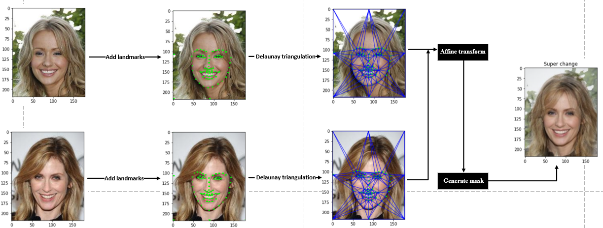
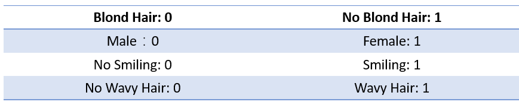
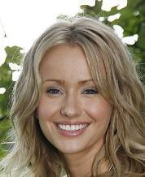

# I. INTRODUCTION

This is a python program about face fusion by using OpenCV. In this project, 2 face images can fuse as one face based on the 68 face features extracted by OpenCV. 

Here I've provided the source code in two versions. 

1. The face-merge.ipynb shows the detailed procress about the face fusion. For users who only need the face merge procress, they can use this version to get an intuitive understanding.

2. The face-merge.py is a part of my HKU COMP7305 group work. It uses [CelebA](intuitive understanding) to find a similar image about the input image and merges a new image based on the features. The demo about this project is [here](https://www.youtube.com/watch?v=R2gmTjCcBEE) and face fusion is used in the last part. 

# II. REQUIREMENT

## 2.1 OpenCV

[OpenCV](https://opencv.org/) (Open Source Computer Vision Library) is released under a BSD license and hence it’s free for both academic and commercial use. It has C++, Python and Java interfaces and supports Windows, Linux, Mac OS, iOS and Android. 

In this project, we need to install OpenCV-Python in Ubuntu OS. Please consult [office guide](https://docs.opencv.org/master/d2/de6/tutorial_py_setup_in_ubuntu.html) to install it.

## 2.2 dlib

[dlib](http://dlib.net/) is a modern C++ toolkit containing machine learning algorithms and tools for creating complex software in C++ to solve real world problems. It is used in both industry and academia in a wide range of domains including robotics, embedded devices, mobile phones, and large high performance computing environments. 

Please consult [source code](https://github.com/davisking/dlib) in Github to install.

## 2.3 Scipy

In this project, we need to use [Delaunay triangulation](https://en.wikipedia.org/wiki/Delaunay_triangulation) to finish the fusion process. To accomplish this function, please install scipy based on this [office guide](https://www.scipy.org/install.html).

# III. EXECUTION STEP

## 3.1 face-merge.ipynb

The theory about face fusion is written in this jupyter notebook and users can run each code block step by step to get an overall understanding.

## 3.2 face-merge.py

This program is designed for face fusion by using CelebA. CelebFaces Attributes Dataset (CelebA) is a large-scale face attributes dataset with more than 200K celebrity images, each with 40 attribute annotations. The images in this dataset cover large pose variations and background clutter. CelebA has large diversities, large quantities, and rich annotations, including:

1. 10,177 number of identities,

2. 202,599 number of face images, and

3. 5 landmark locations, 40 binary attributes annotations per image.

The dataset can be employed as the training and test sets for the following computer vision tasks: face attribute recognition, face detection, and landmark (or facial part) localization. 

For the 40 binary attributes, we select the Blond_Hair, Male, Smiling and Wavy_Hair as 4 attributes.

In my source code, I've assigned the path about images(in the end part of this program). Thus, users should replace the absolute path to their own to accomplish the process. 

This program provides 6 parameters for users to input. Parameter 1 to 4 are the values of 4 attributes. Please input the features about the original image based on the table:

For example, if you select the original image as below:

The attribute values about this image are: 0 1 1 1, since she has blond hair, is a female, is smilling and has wavy hair.

Parameter 5 is used to selecting the similar image in CelebA. The program will search the images which also show a smiling female with blind wavy hair in CelebA and count the number of result. Suggest that there are 100 images have the same features as the original image. The default value of parameter 5 is 0, which means that the program will merge the first image in these 100 images with the original one. However, users can set the value of parameter 5 to select other images in the searching result.

Parameter 6 is used to set the ratio of the original image in the merged result. The default value is 0.5, which means that the original image and the searched image are equal in the final result. 

Based on the instruction above, users can use the command:

	python face-merge.py 0 1 1 1 10 0.7

to merge the original image with the 11th image which includes an smiling female with blind wavy hair in CelebA to generate a new image in 0.7 ratio.

(The detailed guidance about this part is shown in the last part of [this](https://www.youtube.com/watch?v=R2gmTjCcBEE) video.)

